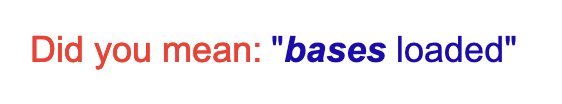

# Blases Loaded

Blases Loaded is a mobile app for live-viewing [Blaseball](https://www.blaseball.com/) games.

## Web App

You can just run it as a "progressive" web app in your browser, with most features equivalent to the mobile version.  Just point your browser to:

* https://rangerrick.github.io/blobile/

## Install from App Store

* [iPhone/iPad](https://apps.apple.com/us/app/id1529695719)
* [Android](https://play.google.com/store/apps/details?id=com.raccoonfink.blobile)

## Beta Testing

* [iPhone/iPad](https://testflight.apple.com/join/e8c8K6WG)
* [Android](https://play.google.com/apps/testing/com.raccoonfink.blobile)

## Feedback and Helping Out

You can follow Blases Loaded [on Twitter](https://twitter.com/BlasesLoadedApp).
I will generally post about updates and new features there.

If you find bugs or have feature suggestions, please open an issue here on the GitHub project.

Also, I lurk on the official Blaseball Discord, and there is a project channel for Blases Loaded development on the [Society for Internet Blaseball Research Discord](https://discord.gg/XTZRmcb).
Pop on in and say hi!

## FAQ

Not really a FAQ, because no one has asked me questions yet, but these are what I _bet_ will be frequently asked questions.

* Can you add a feature to bet/change idols/vote/edit things?<br>
  No. As a member of [SIBR](https://twitter.com/SIBROfficial) I have taken a blood oath to never _write_ to the Blaseball API, only _read_ from it.
  Don't tempt the Blaseball gods!
* Can I make a suggestion for a new feature?<br>
  Absoultely! Just create a [new issue](https://github.com/RangerRick/blobile/issues) with your idea.
  Note that this is just a side-hobby thing, you are at the mercy of my spare time, unless you want to submit a pull request...
  Even still, it's my app, and I retain the right to editorial control. 😉
* What about Blackberry or Windows Phone?<br>
  This is how you know this isn't a real FAQ.
  No one is asking this.
* Why did you make a FAQ when you seem to only have two actual things to mention, one of which is technically also in the "Feedback and Helping Out" section?<br>
  I honestly thought I had more to put here when I started this, but it's too late now.
* Is this related to the [Blases Loaded TTRPG](https://kmsheehan.itch.io/blases-loaded) in any way?<br>
  No, but I _swear_ there were only a few hits for "Blases Loaded" before I announced this project, but now the TTRPG is one of the top hits.
  It looks like a clever, simple Blaseball RPG and you should check it out.
* <br>
  I most certainly did not.

## Development

It's an [Ionic](https://ionicframework.com/) [Angular](https://angular.io/) app, so standard Ionic and Angular tools are used for building.

To run it locally in a browser, do:

```shell
npm install
npm run start
```

To build and run on iOS or Android, do:

```shell
npm install -g @ionic/cli
npm install
ionic cap run [android|ios]
```

## License

<p xmlns:dct="http://purl.org/dc/terms/" xmlns:cc="http://creativecommons.org/ns#" class="license-text"><a rel="cc:attributionURL" property="dct:title" href="https://github.com/RangerRick/blobile">Blases Loaded</a> by <a rel="cc:attributionURL dct:creator" property="cc:attributionName" href="https://github.com/RangerRick">Benjamin Reed</a> is licensed under <a rel="license" href="https://creativecommons.org/licenses/by-nc/4.0">CC BY-NC 4.0</a></p>
